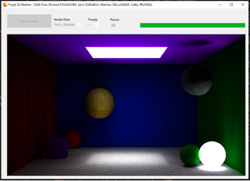
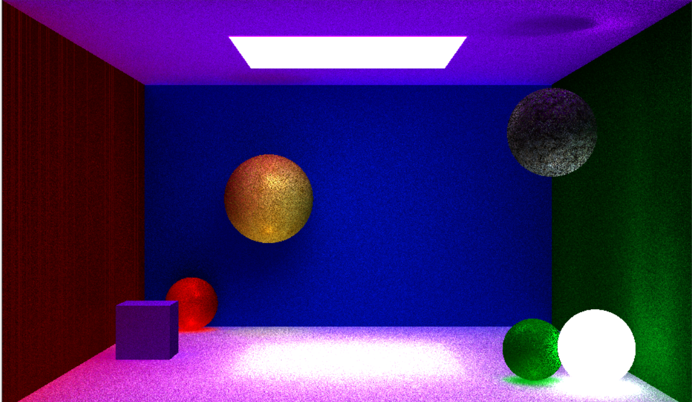
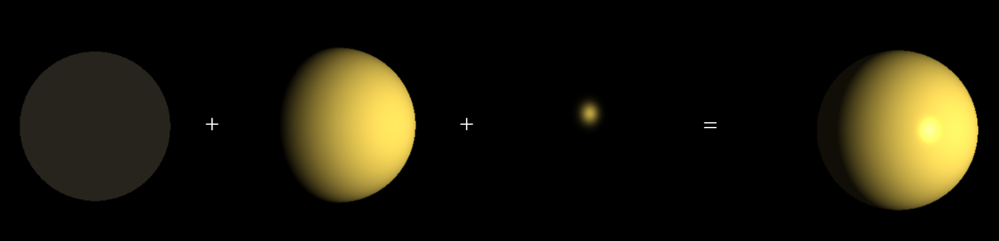
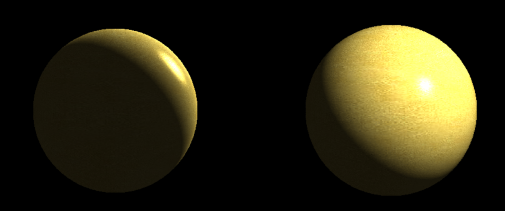
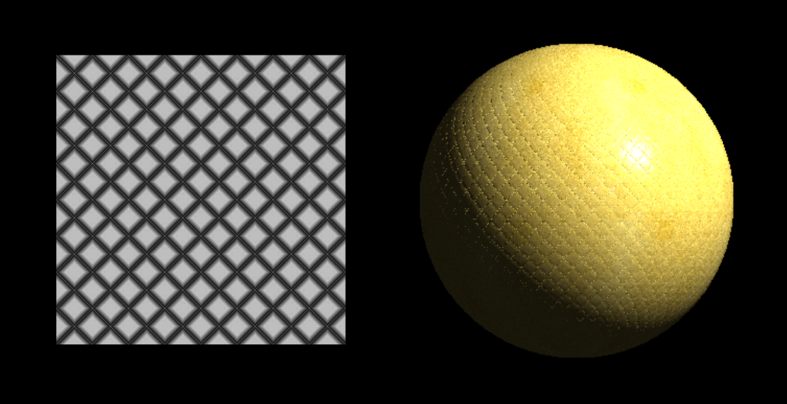
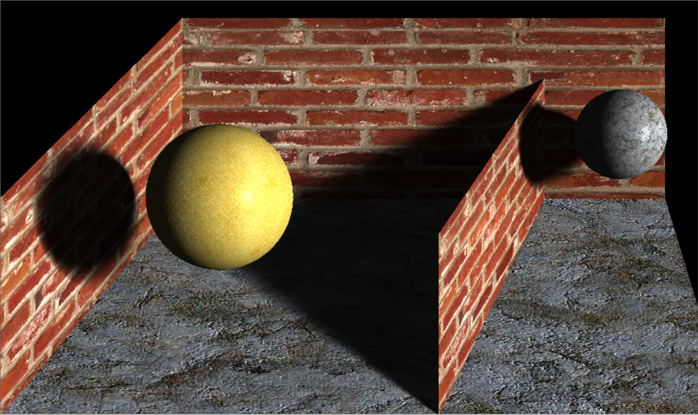

*Travail réalisé dans le cadre d'un projet étudiant en deuxième année du cycle ingénieur (E4) à ESIEE Paris dans la filière Informatique & Applications*

# C# 3D Path Tracing Engine

 

# Features

- Prise en charge de multiples objets basiques :
  - Sphères
  - Parallélépipèdes 
  - Parallélogrammes
- UV Texture mapping
- Bump mapping
- Ray casting
- Path tracing
- Virtual Point Lights
- CPU Multithread
- Modèle d'illumination de Phong
  - Ambiant
  - Diffus
  - Spéculaire
- Soft shadow

# Phong illumination

# Bump mapping

# Soft shadow

# Release note

## [v0.4](https://github.com/richard-ioi/3D-Path-Tracing-Engine/pull/7)

- Suppression de parallélépipède et implémentation du parallélogramme
- Adaptation de Parallelogramme3D en conséquence

## [v0.3.3](https://github.com/richard-ioi/3D-Path-Tracing-Engine/pull/6)

- Ajout d'un nouveau système de lampe (FILL / KEY Light)
- Adaptation de la classe Objet3D a ce nouveau système de lumière

## [v0.3.2](https://github.com/richard-ioi/3D-Path-Tracing-Engine/pull/5)

- Définition de l'objet selon une texture et non une couleur
- Restructuration des méthodes de génération de couleur de l'objet
- Nouveaux attributs pour un Objet3D
- Surcharge d'opérateurs dans la classe Couleur

## [v0.3.1](https://github.com/richard-ioi/3D-Path-Tracing-Engine/pull/4)

- Mise en place d'une nouvelle architecture
- Ajout de lumière
- Intégration de la texture à la lumière

## [v0.2.1](https://github.com/richard-ioi/3D-Path-Tracing-Engine/pull/3)

- Clean du git et des fichier de build
- Mise en place d'un git ignore

## [v0.2](https://github.com/richard-ioi/3D-Path-Tracing-Engine/pull/2)

- Implémentation du système de couleur dans les classes

## [v0.1](https://github.com/richard-ioi/3D-Path-Tracing-Engine/pull/1)

- Création d'une classe sphère 
- Création d'une classe rectanle

## v0.0

- Creation du repo à partir du projet
